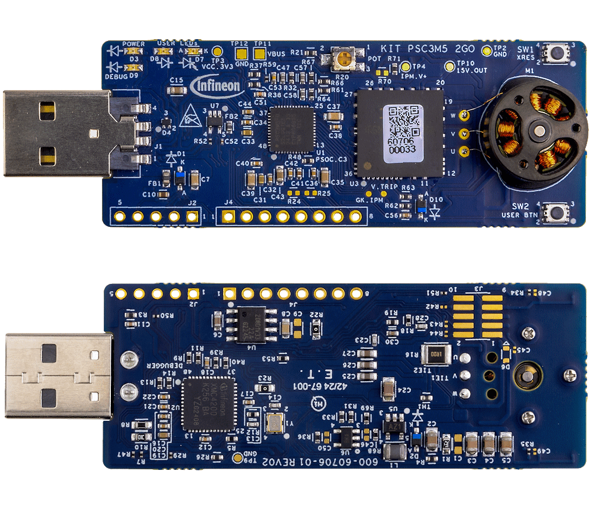

# KIT_PSC3M5_2GO BSP

## Overview

PSOC™ Control C3M5 Compact Kit - This board has the PSOC™ Control C3M5 device with debugger, IPM and BLDC motor.     Equipped with an Arm® Cortex®-M33 based PSOC™ Control microcontroller from Infineon Technologies AG,     the PSOC™ Control C3M5 Compact Kit is designed to demonstrate the capabilities of Infineon's PSOC™ Control C3M5     Microcontroller for motor control applications in a standalone plug and play form factor.     
**Note:**
Programming this kit requires installing 
[SEGGER J-Link software](https://www.segger.com/downloads/jlink/#J-LinkSoftwareAndDocumentationPack)

To use code from the BSP, simply include a reference to `cybsp.h`.

## Features

### Kit Features:

* PSOC™ Control C3M5 (Arm® Cortex®-M33 based) Microcontroller
* On-board Debug Probe with USB interface supporting SWD 
* J-Link debugger and UART virtual COM port
* One user button and potentiometer
* Two user LEDs
* USB operation with boost for IPM gate drive
* Multiple clock options
* IPM for driving the motor
* Small BLDC motor running on USB power

### Kit Contents:

* KIT_PSC3M5_2GO evaluation board
* Screwdriver for potentiometer

## BSP Configuration

The BSP has a few hooks that allow its behavior to be configured. Some of these items are enabled by default while others must be explicitly enabled. Items enabled by default are specified in the KIT_PSC3M5_2GO.mk file. The items that are enabled can be changed by creating a custom BSP or by editing the application makefile.

Components:
* Device specific category reference (e.g.: CAT1) - This component, enabled by default, pulls in any device specific code for this board.

Defines:
* CYBSP_WIFI_CAPABLE - This define, disabled by default, causes the BSP to initialize the interface to an onboard wireless chip if it has one.
* CY_USING_HAL - This define, enabled by default, specifies that the HAL is intended to be used by the application. This will cause the BSP to include the applicable header file and to initialize the system level drivers.
* CYBSP_CUSTOM_SYSCLK_PM_CALLBACK - This define, disabled by default, causes the BSP to skip registering its default SysClk Power Management callback, if any, and instead to invoke the application-defined function `cybsp_register_custom_sysclk_pm_callback` to register an application-specific callback.

### Clock Configuration

| Clock    | Source    | Output Frequency |
|----------|-----------|------------------|
| FLL      | IMO       | 100.0 MHz        |
| CLK_HF0  | CLK_PATH1 | 180 MHz          |
| CLK_HF1  | CLK_PATH1 | 180 MHz          |
| CLK_HF2  | CLK_PATH0 | 100 MHz          |
| CLK_HF3  | CLK_PATH2 | 240 MHz          |
| CLK_HF4  | CLK_PATH0 | 100 MHz          |

### Power Configuration

* System Active Power Mode: OD
* System Idle Power Mode: CPU Sleep 
* VDDA Voltage: 3300 mV
* VDDD Voltage: 3300 mV

See the [BSP Setttings][settings] for additional board specific configuration settings.

## API Reference Manual

The KIT_PSC3M5_2GO Board Support Package provides a set of APIs to configure, initialize and use the board resources.

See the [BSP API Reference Manual][api] for the complete list of the provided interfaces.

## More information
* [KIT_PSC3M5_2GO BSP API Reference Manual][api]
* [KIT_PSC3M5_2GO Documentation](http://www.infineon.com/KIT_PSC3M5_2GO)
* [Cypress Semiconductor, an Infineon Technologies Company](http://www.cypress.com)
* [Infineon GitHub](https://github.com/infineon)
* [ModusToolbox™](https://www.cypress.com/products/modustoolbox-software-environment)

[api]: https://infineon.github.io/TARGET_KIT_PSC3M5_2GO/html/modules.html
[settings]: https://infineon.github.io/TARGET_KIT_PSC3M5_2GO/html/md_bsp_settings.html

---
© Cypress Semiconductor Corporation (an Infineon company) or an affiliate of Cypress Semiconductor Corporation, 2019-2024.